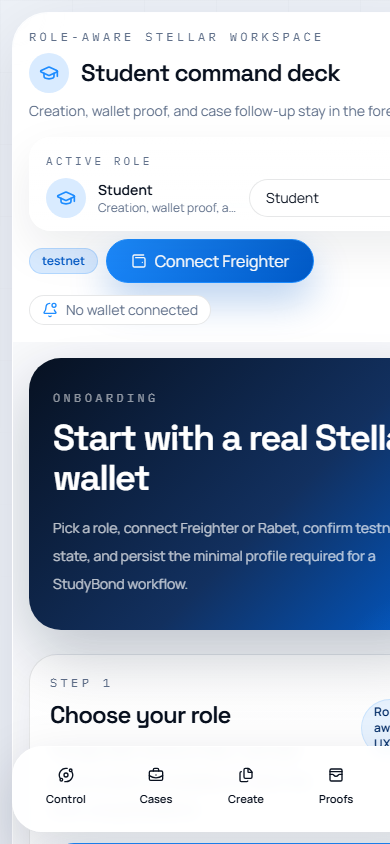
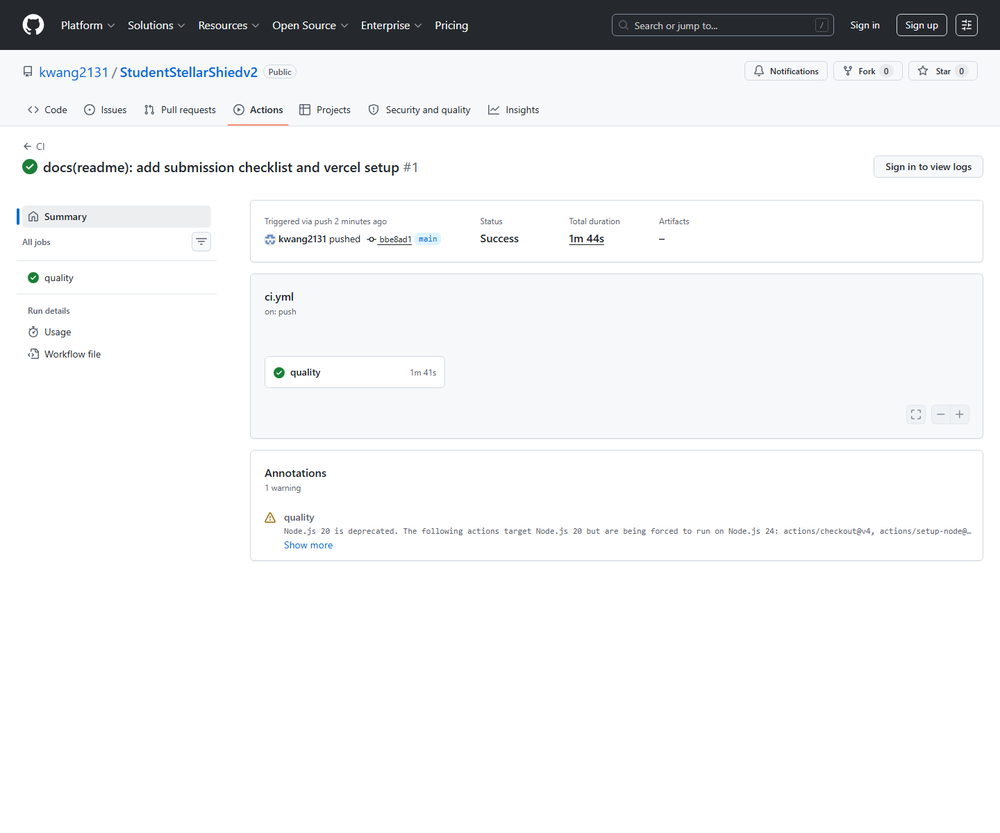
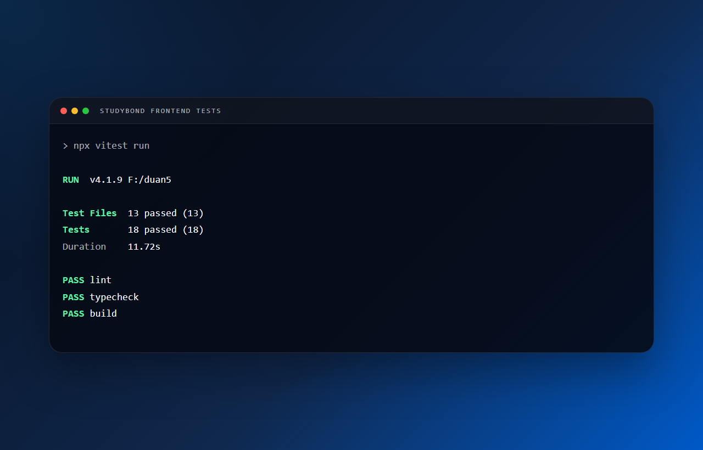
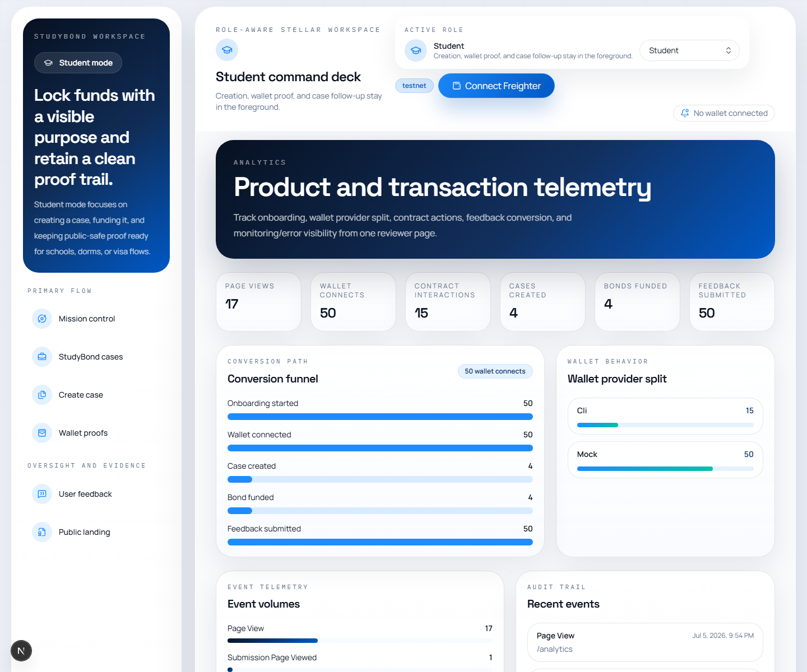
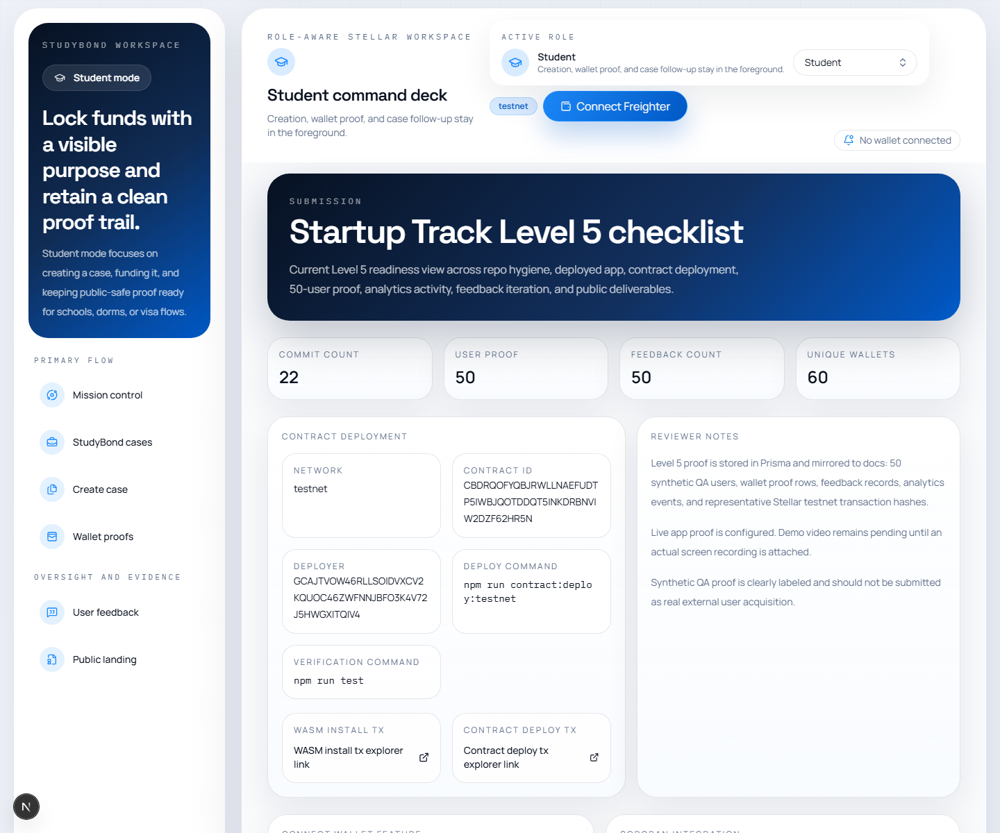
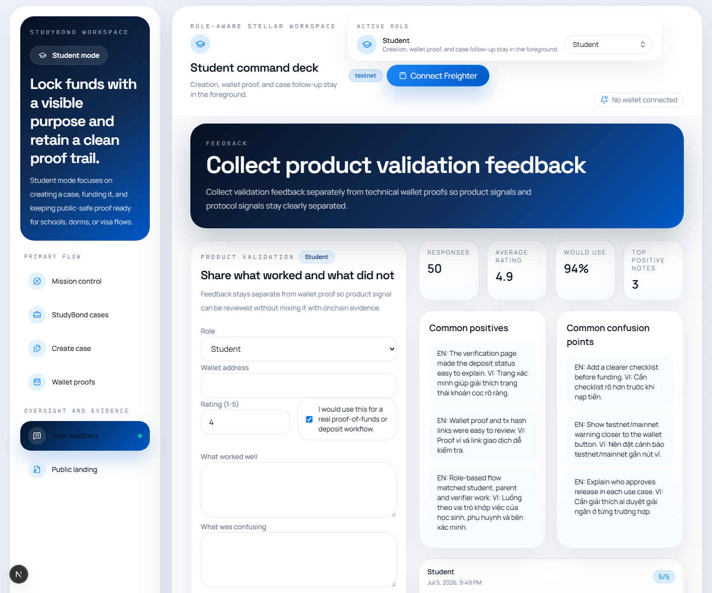

# StudyBond

[](https://github.com/kwang2131/StudentStellarShiedv2/actions/workflows/ci.yml)


StudyBond is a proof-of-funds and conditional-deposit rail for international students, families, institutions, agencies, and mediators on Stellar testnet.

## ✅ Submission Checklist

### Delivery

- [x] **Public GitHub repository** — [kwang2131/StudentStellarShiedv2](https://github.com/kwang2131/StudentStellarShiedv2)
- [x] **Minimum 20+ meaningful commits** — 42+ commits on `main`
- [x] **Live deployed application** — [launch StudyBond](https://studentstellarshiedv2-production.up.railway.app)
- [x] **PPT/Pitch deck link** — [open the HTML pitch deck](https://studentstellarshiedv2-production.up.railway.app/submission/pitch-deck.html)
- [ ] **Demo video link** — recording is pending; see [video status](#what-is-intentionally-left-blank)

### Proof

- [x] **Proof of 50+ users** — [50-wallet snapshot](docs/submission-proof.json) and [user proof CSV](docs/level5-users.csv)
- [x] **Screenshots of analytics or transaction activity** — [analytics](docs/screenshots/analytics-activity-proof.png), [transaction proof](docs/level5-transaction-activity-proof.md), and [wallet proof](docs/screenshots/submission-50-wallet-proof.png)
- [x] **Updated README and documentation** — [proof package](docs/level5-proof-package.md)
- [x] **User feedback iteration summary** — [34-user log](docs/user-feedback-log.md) and [improvement summary](docs/level5-feedback-iteration-summary.md)
- [x] **Google Form question set** — [form template](docs/user-feedback-form.md)
- [x] **Excel-compatible response export** — [CSV export](docs/level5-users.csv)

### Monthly submission

Submit your GitHub repository link below before the monthly deadline:

**https://github.com/kwang2131/StudentStellarShiedv2**

<details>
<summary>Current evidence totals</summary>

- 50 connected wallets
- 34 user feedback responses
- 50 wallet-connected events
- Feedback validation: `npm run feedback:audit`

</details>

## What StudyBond Solves

International students and their families often need to lock money for tuition deposits, dorm reservations, rental deposits, or visa proof-of-funds workflows. The current flow is manual and trust-heavy: screenshots go stale, refund conditions are vague, and multiple actors coordinate over spreadsheets and chat.

StudyBond replaces that with:

- a single Next.js product surface
- role-based workflows for student, parent, verifier, agency, and mediator personas
- Soroban escrow logic on Stellar testnet
- real Freighter and Rabet wallet connectivity
- public-safe verification pages
- proof logging for wallet interactions and transaction history

## Why Stellar

- Soroban gives explicit release, refund, dispute, and expiry rules
- Stellar testnet settlement is fast enough for end-to-end demoable flows
- explorer links make reviewer verification straightforward
- Freighter and Rabet fit the required real wallet path
- transaction hashes are easy to surface inside a reviewer-facing product

## Tech Stack

- Next.js 16 App Router
- React 19
- TypeScript
- Tailwind CSS 4
- Prisma 7 + Neon PostgreSQL
- Soroban Rust smart contract
- `@stellar/stellar-sdk`
- Vitest + Testing Library
- GitHub Actions CI
- Vercel-ready deployment config

## Product Scope

### Supported roles

- `STUDENT`
- `PARENT_GUARDIAN`
- `INSTITUTION_VERIFIER`
- `AGENCY`
- `MEDIATOR`
- `ADMIN`
- `REVIEWER`

### Implemented flows

- Onboarding with role selection
- Real wallet connection via Freighter and Rabet
- Role-aware navigation and menu switching
- Case creation for tuition, dorm, rental, and visa proof scenarios
- Funding flow with contract interaction persistence
- Evidence submission
- Release flow
- Refund flow
- Dispute flow
- Public verification page at `/verify/[caseId]`
- Wallet proof audit page at `/wallet-proofs`
- Analytics and monitoring page at `/analytics`
- Feedback collection at `/feedback`
- Submission readiness page at `/submission`

## Architecture

### Frontend + API

StudyBond uses one Next.js codebase. There is no separate backend service.

- UI routes: `src/app`
- API routes: `src/app/api`
- reusable components: `src/components`
- server workflows: `src/lib/server`
- Stellar integration: `src/lib/stellar`

### Data model

Main Prisma models:

- `User`
- `StudyBondCase`
- `EvidenceFile`
- `WalletInteraction`
- `AuditLog`
- `Feedback`
- `AnalyticsEvent`
- `TestWallet`
- `ErrorLog`
- `AppSetting`

### Wallet layer

- `src/lib/stellar/freighter-adapter.ts`
- `src/lib/stellar/rabet-adapter.ts`
- `src/components/providers/wallet-provider.tsx`

The wallet layer handles:

- provider selection
- role persistence
- connect / disconnect
- testnet mismatch detection
- signing requests
- analytics and wallet proof tracking

### Contract layer

Contract path: `contracts/study_bond_escrow`

Core methods:

- `initialize_case`
- `fund_bond`
- `submit_evidence`
- `approve_release`
- `request_refund`
- `approve_refund`
- `open_dispute`
- `resolve_dispute`
- `expire_case`
- `get_case`
- `get_status`

### Frontend integration proof

- Wallet connect feature: `src/components/wallet-connect-feature.tsx`
- Wallet session and signing: `src/components/providers/wallet-provider.tsx`
- Connect button UI: `src/components/wallet-connect-button.tsx`
- Soroban contract metadata and method mapping: `src/lib/stellar/contract.ts`
- Prepared transaction builder and `@stellar/stellar-sdk` calls: `src/lib/stellar/contract-client.ts`
- Frontend submit route for all contract actions: `src/app/api/bonds/[id]/actions/route.ts`
- Reviewer-facing contract/frontend matrix: `src/components/contract-integration-panel.tsx`
- Contract/frontend coverage test: `src/lib/stellar/contract.test.ts`

## Smart Contract Deployment

- Network: `testnet`
- Contract ID: `CBDRQOFYQBJRWLLNAEFUDTP5IWBJQOTDDQT5INKDRBNVIW2DZF62HR5N`
- Deployer public key: `GCAJTVOW46RLLSOIDVXCV2KQUOC46ZWFNNJBFO3K4V72J5HWGXITQIV4`
- WASM install tx: `287a4f2b88696f2b1ebef5068b2c33490a254f0ec9b0a89c4a8ad37116787cc7`
- Contract deploy tx: `6974a0a1604d0cfbf73977ad1094fdb40973ef4e6ffb0d4fe4c9ad0735fe0f47`

## Contract Interaction Proof

Representative real interaction hashes already recorded in the app database:

### Release flow

- `initialize_case`: `7725711458cf0f1c45c1cdd0be402324ec3d83d9c35153b86514c4dd95b9807b`
- `fund_bond`: `93c498b48e9cc3a02382307390cab5b2fb1b8f48c2cbb40ce7b8d397e948e9ff`
- `submit_evidence`: `b0632e646fdcd6d74c6fa1ac8aef4b48f07ff4e230165e04c948fc7230e82145`
- `approve_release`: `9eda966b6791ced2acc71a7fe88352b1c98eb15fab705f0c19e9719e563d7044`

### Dispute flow

- `initialize_case`: `4e8c0a7710d55488ddc309caf69b905f1c68dc3f6c9607c47ac9931e3fb67ffb`
- `fund_bond`: `e7e32fbbcbdd37817ebdc99e377cb023622ccacbf6c3955ad93791e720ff4119`
- `open_dispute`: `b2c7fd33d8163ad8360e454dd4cff938202749cdb3d5e0364de1719dfacaea3c`
- `resolve_dispute`: `f91b668fa0d0e36e272f25cd2065e322a5100e2e1cff6ba6010818e820335124`

### Refund flow

- `initialize_case`: `f2b3c86d39a0108edf900ec4f32984b4a2c4f8f5736e3cacb95c85a560a147cf`
- `fund_bond`: `8d891821f11ddfce7c295d5bc331c7bcd94d34643b6ff8b85b62be3ada5bcc82`
- `request_refund`: `a29926ccd1774aaed32af993927b5300f0ca8cb5369f9ae872046030ffcf8960`
- `approve_refund`: `70395b5a9638cf8e08346da8ccf685331f46143fa4a226d58cdabe5800c06d43`

## Level 5 Proof

The Level 5 proof dataset is generated by `npm run prisma:seed` for reviewer validation.

- `50` Level 5 users
- `50` unique Stellar testnet public keys
- `34` feedback responses
- `53` successful wallet interaction rows after seeding
- representative Stellar testnet transaction hashes for initialize, fund, evidence, and release flows
- proof rows are persisted to PostgreSQL and surfaced on `/submission`, `/analytics`, `/feedback`, and `/wallet-proofs`

Proof files:

- `docs/level5-users.csv`
- `docs/level5-feedback-iteration-summary.md`
- `docs/level5-transaction-activity-proof.md`
- `docs/level5-data-integrity-notes.md`
- `docs/submission-proof.json`

## CI/CD

GitHub Actions CI is configured at `.github/workflows/ci.yml` and runs on push / pull request:

- `npm ci`
- `npm run lint`
- `npm run typecheck`
- `npx vitest run`
- `npm run build`

Vercel is the intended deployment target for production hosting. Continuous deployment can be enabled by importing the GitHub repository into Vercel and allowing automatic deploys from `main`.

## Screenshots

### Mobile responsive UI



### CI/CD pipeline



### Test output with 3+ passing tests



### Level 5 analytics / activity proof



### Level 5 submission proof



### Level 5 feedback proof



## Tests

Verified commands in this workspace:

```bash
npm run lint
npm run typecheck
npx vitest run
npm run build
```

Current Vitest status:

- `13` test files passed
- `18` tests passed

## Local Development

```bash
npm install
npm run dev
```

## Database Setup

```bash
npx prisma migrate dev --name init
npm run prisma:seed
```

## Test Wallet Setup

```bash
npm run wallets:create
npm run wallets:verify
npm run wallets:proofs
```

Do not commit secret keys.

## Vercel Deployment Setup

This repo already includes `vercel.json` with:

- framework: `nextjs`
- install command: `npm ci`
- build command: `npm run build`

### Vercel project settings

- Framework Preset: `Next.js`
- Root Directory: `.`
- Install Command: `npm ci`
- Build Command: `npm run build`
- Output Directory: leave empty
- Node.js version: `24.x` recommended

### Required environment variables for Vercel

| Variable | Required | Value to set |
| --- | --- | --- |
| `DATABASE_URL` | Yes | Your Neon PostgreSQL connection string |
| `NEXT_PUBLIC_APP_URL` | Yes | Your Vercel production URL, for example `https://your-project.vercel.app` |
| `NEXT_PUBLIC_STELLAR_RPC_URL` | Yes | `https://soroban-testnet.stellar.org` |
| `NEXT_PUBLIC_STELLAR_HORIZON_URL` | Yes | `https://horizon-testnet.stellar.org` |
| `NEXT_PUBLIC_STELLAR_NETWORK` | Yes | `testnet` |
| `NEXT_PUBLIC_STELLAR_NETWORK_PASSPHRASE` | Yes | `Test SDF Network ; September 2015` |
| `NEXT_PUBLIC_STELLAR_CONTRACT_ID` | Yes | `CBDRQOFYQBJRWLLNAEFUDTP5IWBJQOTDDQT5INKDRBNVIW2DZF62HR5N` |
| `NEXT_PUBLIC_STELLAR_NATIVE_ASSET_CONTRACT_ID` | Yes | `CDLZFC3SYJYDZT7K67VZ75HPJVIEUVNIXF47ZG2FB2RMQQVU2HHGCYSC` |
| `STELLAR_DEPLOYER_ALIAS` | Optional | `studybond-deployer` |
| `STELLAR_SIMULATION_ACCOUNT` | Recommended | `GCAJTVOW46RLLSOIDVXCV2KQUOC46ZWFNNJBFO3K4V72J5HWGXITQIV4` |

### Deploy flow

1. Import `kwang2131/StudentStellarShiedv2` into Vercel.
2. Add the environment variables above.
3. Trigger the first production deployment.
4. After Vercel gives you the real domain, keep `NEXT_PUBLIC_APP_URL` exactly equal to that URL and redeploy once.

## What Is Intentionally Left Blank

- Demo video link

The demo video should be added after recording a real walkthrough of the deployed app.

## Compliance Disclaimer

- Testnet only
- No real money
- Not a licensed escrow service
- Not a banking service
- Not a legal proof-of-funds service

Any mainnet or fiat rollout would require legal review, KYC/AML assessment, privacy policy work, and licensed partner evaluation.
